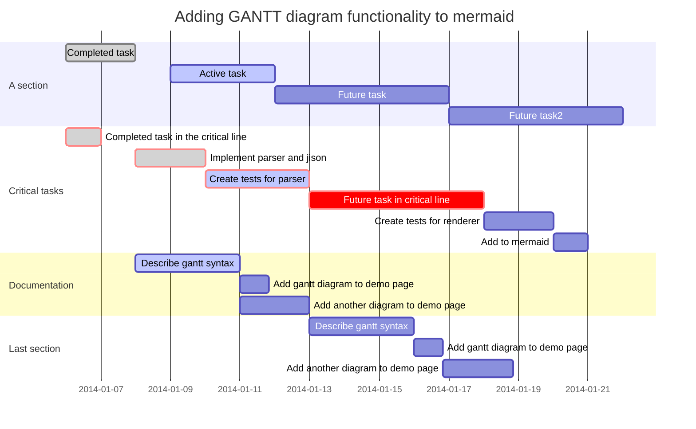
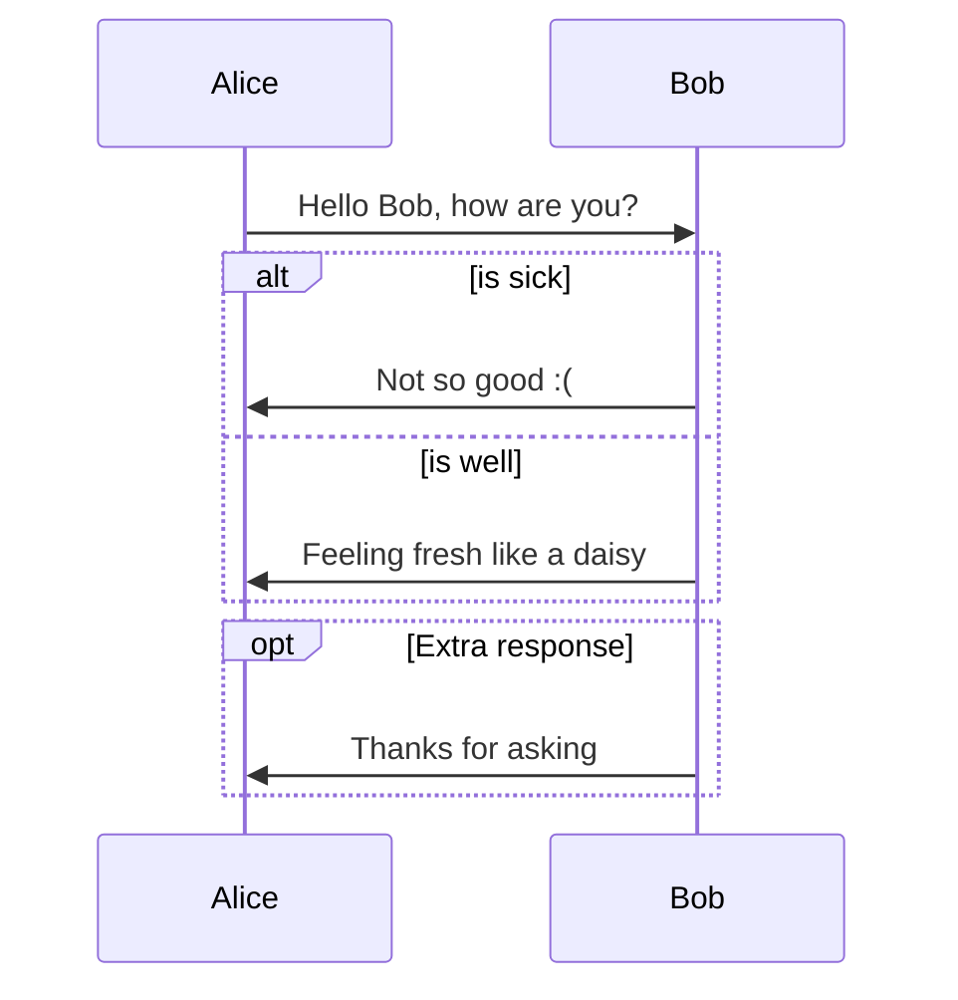
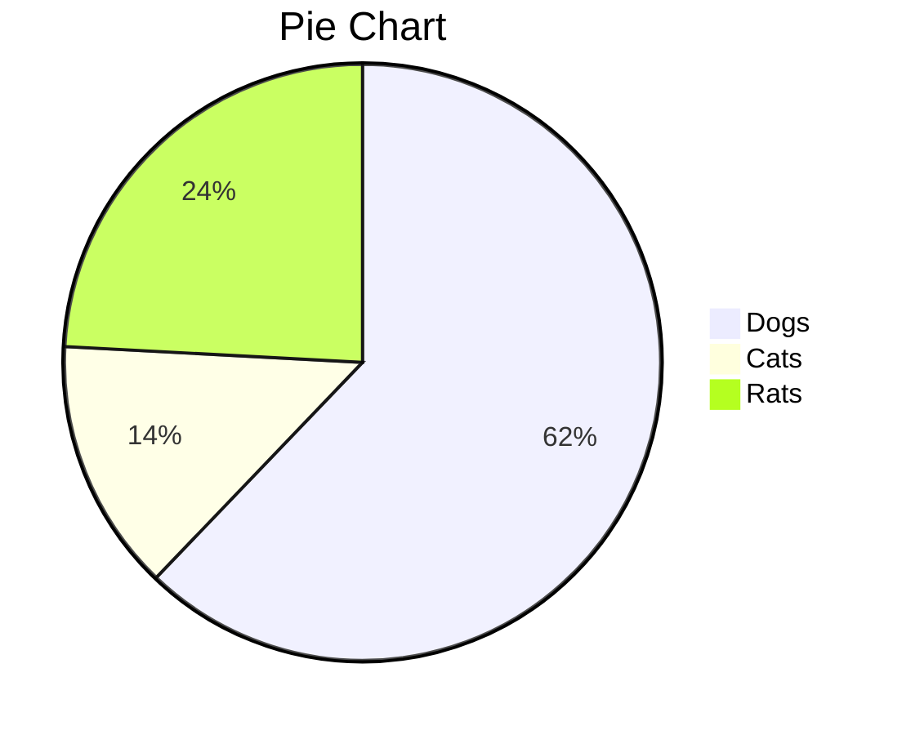

[TOC]

# Typora lernen


## 1.Unterschied zwischen Markdown und WORD

富文本编辑器**Word**：所见即所得，图形化

两个过程，输入文字，然后编辑文字

输入文字，然后鼠标选择不同功能，处理后的效果直接显示Bildschrim。出于软件工程原因，不能保证在任何地方打开都显示同样的的效果，有可能乱码。

**Markdown**编辑器：通过标记字符，输入字符同时进行 排版 和 内容输入

一个过程，输入文字同时进行排版

输入文字的前后输入代码标记，输入后在 编辑窗口也不会立  即显示最终效果，需要手动。所有编辑器都是基于一套语法啦编写转换流程，以及markdown格式保持文件本之是一份纯文本，就能保证所有平台都有工具能打开。无论是mac还是windows。

书写错误导致的排版错误易发现

 

Markdown是一套标记语法，语法用来赋予文字不同格式

Markdown编辑器，能将字符转换，呈现我们

 

## 2.Markdown Syntax  ##

### 2.1对文字样式的编辑 ###


> **加粗**

> *斜体*

> ***斜体加粗***


### 2.2对段落的编辑 ###

> + 演示列表
>   + 列表还有层级


### 2.3插入文章其他元素 ###

> [少数派](https://sspai.com)  &rarr; 插入链接
>
> 
> <center>题注</center>
>
> &rarr;插入图片
>
![男孩][boy]
[boy]:https://tvax4.sinaimg.cn/crop.0.0.512.512.180/bfd1651fly8fw54r4xhfuj20e80e8t94.jpg "男孩"


**加入题注**

`<center>Abbildung</center>`


## 3. Markdown 进阶 ##

### 3.1 对基本语法的扩展 ### 

**引用（Quoting）**

```
Quoting Code

   ``` % quoting code 
   ` git status ` %high light 
```

```
多层嵌套：
>这是引用文字  
>>这是多重引用文字 
>这是一段无法跳出多层嵌套的文字
>>>这是多重引用文字 

>这是第一段引用文字  
>这是第二段引用文字 
```

>这是引用文字  
>>这是多重引用文字 
>>这是一段无法跳出多层嵌套的文字
>>
>>>这是多重引用文字 

>这是第一段引用文字  
>这是第二段引用文字


Use ` git status ` to list all new or modified files that haven't yet been committed

```
insert Tabelle 

	| First Header | Second Header |
	| :------------ | :------------:  | :剧中:
	| Content cell | Content Cell  |
	
```
| First Header | Second Header |
| :------------ | :-------------: |
| Content cell | content cell  |
| Content cell| content cell|

**目录列表(Table of Contents)**

>`TOC`

**注脚**
Markdown[^1]是一种很有效的书写文档，可以直接转换成HTML[^2]

[^1]: Markdown 是一种纯文本标记语言
[^2]: Hypertext MarkUp Language 超文本标记语言

**超链接（Hyperlink）**
`[Link Text](link-address) ` `http://` **不能省略**

**链接引用**（Reference Link）
`[]:`
[少数派]:https://sspai.com/post/54912
[科列]:http://www.klclear.com

**内部跳转/锚点（internal links）**
[见某某文献](#Anhang)`注意没有空格
写paper经常用到的就是，正如 [章节1](#图形化)所提到的

### 特殊字符 & 数学字符

**HTML语法 `&`,`<>`** 

>输入
>`&Delta;` `&copy;`
>得到
>&Delta; , &copy;

>如果想escape character 可以用
>`\*`
>得到
>*


**Tex语法** 

>`$\uparro$`
>`$e^2$` 
>$e^2$

**Typora**

>下标
>U~in~
>上标(hochstellen)
>U^2^


### 3.2 对通用语法的修改{#1} ###

~~要删除的文字~~

但是在Bear中，开发者定义为 `-要删除的文章-`


- [x] tasklist 

  


### 图形化(Draw Diagrams)
[官方手册](https://support.typora.io/Draw-Diagrams-With-Markdown/)

**流程图**
更多流程图语法参考（http://flowchart.js.org/)、[Mermaid流程图](https://mermaidjs.github.io/

```flow
st=>start: Start
op=>operation: Your Operation
cond=>condition: Yes or No?
e=>end

st->op->cond
cond(yes)->e
cond(no)->op
```

**甘特图**
更多甘特图语法参考https://mermaidjs.github.io/



**序列图**
更多序列图语法参考https://bramp.github.io/js-sequence-diagrams/、https://mermaidjs.github.io/


**$\pi$ Chart**



## Markdown 下 $\LaTeX$公式

这篇[文章](https://juejin.im/post/5a6721bd518825733201c4a2)有关于markdown 插入数学公式的合集 

**混合上下标**
$$x_{dd}^{2a}$$


**公式的编号**

> `$$
> P_m=\frac{1}{\eta}(\frac{mgf}{3600}u + \frac{C_dA}{76140}u^3 + \frac{mgi}{3600}+\frac{\delta mu}{3600}\frac{du}{dt}) \tag{1.1}
> $$`
>
> 在公式之后，`$$`之前添加`\tag{1.1}`

$$
P_m=\frac{1}{\eta}(\frac{mgf}{3600}u + \frac{C_dA}{76140}u^3 + \frac{mgi}{3600}+\frac{\delta mu}{3600}\frac{du}{dt}) \tag{1.1}
$$


**单个公式换行**
单个公式很长的时候需要换行，但仅允许生成一个编号时，可以用`\begin{split}``\end{split}`标签包围公式代码，在需要转行的地方使用`\`，每行需要使用**1个&**来标识对齐的位置，结束后可使用\tag{...}标签编号。
$$
\begin{split}
P_m=\frac{mgf}{3600}u +&\\
\frac{C_dA}{76140}u^3 +&\\
\frac{mgi}{3600}+&\\
\frac{\delta mu}{3600}\frac{du}{dt} 
\end{split}\tag{1.1}
$$

*注意：每行只允许出现一个&，使用split标签后，编号会上下居中显示。*

**多行的独立公式**
有时候需要罗列多个公式，可以用`\begin{eqnarray*}`标签包围公式代码，在需要转行的地方使用`\\`，每行需要使用**2个&**来标识对齐位置，两个&...&号之间的是公式间对齐的位置，每行公式后可使用`\tag{...}`标签编号：

    $$
    \begin{eqnarray*}
    x^n+y^n &=& z^n \tag{1.4} \\
    x+y &=& z \tag{1.5}
    \end{eqnarray*}
    $$

$$
\begin{eqnarray*}
    x^n+y^n &=& z^n \tag{1.4} \\
    x+y &=& z \tag{1.5}
    \end{eqnarray*}
$$


$$\pm$$ 

## Anhang  
s_x
### 1. 特殊符号 

[特殊符号](https://blog.csdn.net/logicr/article/details/82414854)

[Unicode-Zeichentabelle](https://unicode-table.com/de/search/?q=%E6%8B%89%E4%B8%81)

[LaTeX Math Symbols](https://www.math.uci.edu/~xiangwen/pdf/LaTeX-Math-Symbols.pdf)

### 2. Emoji ###

[emoji](https://www.webfx.com/tools/emoji-cheat-sheet/)

:joy:

## 参考 ##
1. [Typora 完全使用详解 ](https://sspai.com/post/54912)
2. [Markdown syntax reference](https://waher.se/Markdown.md)
3. [Markdown Reference](http://support.typora.io/Markdown-Reference/#footnotes)(官方)


疑问

1.居中存在问题,当居中用`<center>内容</center>`内容仍然想输入`&rarr`.在HTML语法中不直接显示`&rarr;`
